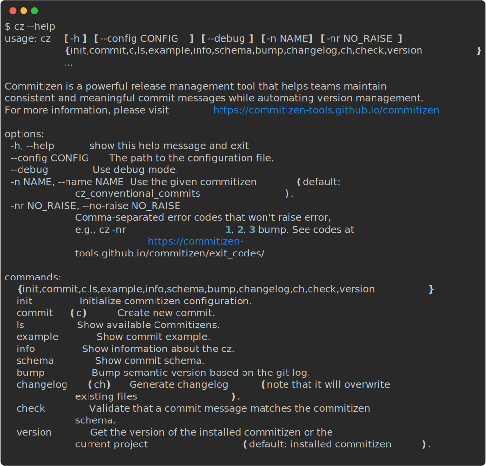

[](https://github.com/commitizen-tools/commitizen/actions)
[](https://conventionalcommits.org)
[](https://pypi.org/project/commitizen/)
[](https://pypi.org/project/commitizen/)
[](https://pypi.org/project/commitizen/)
[](https://anaconda.org/conda-forge/commitizen)
[](https://formulae.brew.sh/formula/commitizen)
[](https://codecov.io/gh/commitizen-tools/commitizen)
[](https://github.com/pre-commit/pre-commit)


---

[**Commitizen Documentation Site**](https://commitizen-tools.github.io/commitizen/)

---

## About

Commitizen is a powerful release management tool that helps teams maintain consistent and meaningful commit messages while automating version management.

### What Commitizen Does

By enforcing standardized commit conventions (defaulting to [Conventional Commits][conventional_commits]), Commitizen helps teams:

- Write clear, structured commit messages
- Automatically manage version numbers using semantic versioning
- Generate and maintain changelogs
- Streamline the release process

### Key Benefits

With just a simple `cz bump` command, Commitizen handles:

1. **Version Management**: Automatically bumps version numbers and updates version files based on your commit history
2. **Changelog Generation**: Creates and updates changelogs following the [Keep a changelog][keepchangelog] format
3. **Commit Standardization**: Enforces consistent commit message formats across your team

This standardization makes your commit history more readable and meaningful, while the automation reduces manual work and potential errors in the release process.

### Features

- Interactive CLI for standardized commits with default [Conventional Commits][conventional_commits] support
- Intelligent [version bumping](https://commitizen-tools.github.io/commitizen/commands/bump/) using [Semantic Versioning][semver]
- Automatic [keep a changelog][keepchangelog] generation
- Built-in commit validation with pre-commit hooks
- [Customizable](https://commitizen-tools.github.io/commitizen/customization/) commit rules and templates
- Multi-format version file support
- Custom rules and plugins via pip

## Getting Started

### Requirements

Before installing Commitizen, ensure you have:

- [Python](https://www.python.org/downloads/) `3.9+`
- [Git][gitscm] `1.8.5.2+`

### Installation

#### Global Installation (Recommended)

The recommended way to install Commitizen is using [`pipx`](https://pipx.pypa.io/) or [`uv`](https://docs.astral.sh/uv/), which ensures a clean, isolated installation:

**Using pipx:**
```bash
# Install Commitizen
pipx install commitizen

# Keep it updated
pipx upgrade commitizen
```

**Using uv:**
```bash
# Install commitizen
uv tool install commitizen

# Keep it updated
uv tool upgrade commitizen
```

**(For macOS users) Using Homebrew:**
```bash
brew install commitizen
```

#### Project-Specific Installation

You can add Commitizen to your Python project using any of these package managers:

**Using pip:**
```bash
pip install -U commitizen
```

**Using conda:**
```bash
conda install -c conda-forge commitizen
```

**Using Poetry:**
```bash
# For Poetry >= 1.2.0
poetry add commitizen --group dev

# For Poetry < 1.2.0
poetry add commitizen --dev
```

**Using uv:**
```bash
uv add --dev commitizen
```

**Using pdm:**
```bash
pdm add -d commitizen
```

### Basic Commands

#### Initialize Commitizen

To get started, you'll need to set up your configuration. You have two options:

1. Use the interactive setup:
```sh
cz init
```

2. Manually create a configuration file (`.cz.toml` or `cz.toml`):
```toml
[tool.commitizen]
version = "0.1.0"
update_changelog_on_bump = true
```

#### Create Commits

Create standardized commits using:
```sh
cz commit
# or use the shortcut
cz c
```

To sign off your commits:
```sh
cz commit -- --signoff
# or use the shortcut
cz commit -- -s
```

For more commit options, run `cz commit --help`.

#### Version Management

The most common command you'll use is:
```sh
cz bump
```

This command:

- Bumps your project's version
- Creates a git tag
- Updates the changelog (if `update_changelog_on_bump` is enabled)
- Updates version files

You can customize:

- [Version files](https://commitizen-tools.github.io/commitizen/commands/bump/#version_files)
- [Version scheme](https://commitizen-tools.github.io/commitizen/commands/bump/#version_scheme)
- [Version provider](https://commitizen-tools.github.io/commitizen/config/#version-providers)

For all available options, see the [bump command documentation](https://commitizen-tools.github.io/commitizen/commands/bump/).

### Advanced Usage

#### Get Project Version

```sh
# Get your project's version (instead of Commitizen's version)
cz version -p
# Preview changelog changes
cz changelog --dry-run "$(cz version -p)"
```

This command is particularly useful for automation scripts and CI/CD pipelines.

For example, you can use the output of the command `cz changelog --dry-run "$(cz version -p)"` to notify your team about a new release in Slack.

#### Pre-commit Integration

Commitizen can automatically validate your commit messages using pre-commit hooks.

1. Add to your `.pre-commit-config.yaml`:
```yaml
---
repos:
  - repo: https://github.com/commitizen-tools/commitizen
    rev: master  # Replace with latest tag
    hooks:
      - id: commitizen
      - id: commitizen-branch
        stages: [pre-push]
```

2. Install the hooks:
```sh
pre-commit install --hook-type commit-msg --hook-type pre-push
```

| Hook              | Recommended Stage |
| ----------------- | ----------------- |
| commitizen        | commit-msg        |
| commitizen-branch | pre-push          |

> **Note**: Replace `master` with the [latest tag](https://github.com/commitizen-tools/commitizen/tags) to avoid warnings. You can automatically update this with:
> ```sh
> pre-commit autoupdate
> ```

For more details about commit validation, see the [check command documentation](https://commitizen-tools.github.io/commitizen/commands/check/).

## Help & Reference

### Command Line Interface

Commitizen provides a comprehensive CLI with various commands. Here's the complete reference:



### Quick Reference

| Command | Description | Alias |
|---------|-------------|-------|
| `cz init` | Initialize Commitizen configuration | - |
| `cz commit` | Create a new commit | `cz c` |
| `cz bump` | Bump version and update changelog | - |
| `cz changelog` | Generate changelog | `cz ch` |
| `cz check` | Validate commit messages | - |
| `cz version` | Show version information | - |

### Additional Resources

- [Conventional Commits Specification][conventional_commits]
- [Exit Codes Reference](https://commitizen-tools.github.io/commitizen/exit_codes/)
- [Configuration Guide](https://commitizen-tools.github.io/commitizen/config/)
- [Command Documentation](https://commitizen-tools.github.io/commitizen/commands/init/)

### Getting Help

For each command, you can get detailed help by adding `--help`:

```sh
cz commit --help
cz bump --help
cz changelog --help
```

For more details, visit our [documentation site](https://commitizen-tools.github.io/commitizen/).

## Setting up bash completion

Commitizen supports command-line completion through [argcomplete](https://kislyuk.github.io/argcomplete/), which is automatically installed as a dependency. This feature provides intelligent auto-completion for all Commitizen commands and options.

### Supported Shells

- **Bash**: Full support
- **Zsh**: Limited support
- **Fish**: Limited support
- **Tcsh**: Limited support

### Installation Methods

#### Global Installation (Recommended)

If you installed Commitizen globally (e.g., using `pipx` or `brew`), you can enable global completion:

```bash
# Enable global completion for all Python applications
sudo activate-global-python-argcomplete
```

#### User-Specific Installation

For a user-specific installation that persists across sessions:

```bash
# Add to your shell's startup file (e.g., ~/.bashrc, ~/.zshrc)
register-python-argcomplete cz >> ~/.bashrc
```

#### Temporary Installation

For one-time activation in your current shell session:

```bash
# Activate completion for current session only
eval "$(register-python-argcomplete cz)"
```

### Verification

After installation, you can verify the completion is working by:

1. Opening a new terminal session
2. Typing `cz` followed by a space and pressing `TAB` twice
3. You should see a list of available commands

For more detailed information about argcomplete configuration and troubleshooting, visit the [argcomplete documentation](https://kislyuk.github.io/argcomplete/).

## Sponsors

These are our cool sponsors!

<!-- sponsors --><!-- sponsors -->

[conventional_commits]: https://www.conventionalcommits.org
[semver]: https://semver.org/
[keepchangelog]: https://keepachangelog.com/
[gitscm]: https://git-scm.com/downloads
