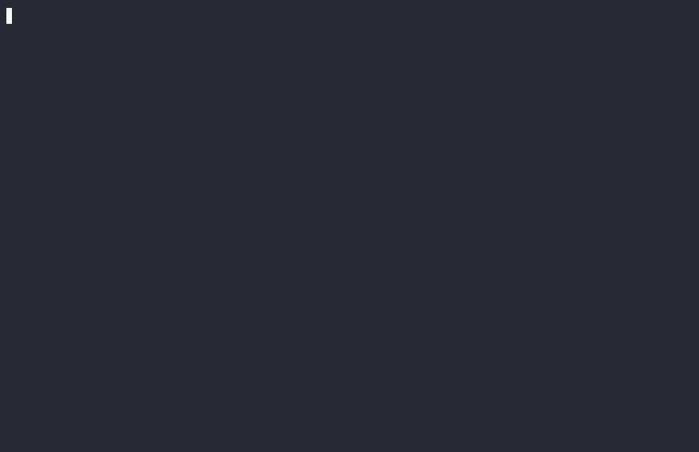

## About

`cz bump` **automatically** increases the version, based on the commits.

The commits should follow the rules established by the committer in order to be parsed correctly.

**prerelease** versions are supported (alpha, beta, release candidate).

The version can also be **manually** bumped.

The version format follows [PEP 0440][pep440] and [semantic versioning][semver].

This means `MAJOR.MINOR.PATCH`

| Increment | Description                 | Conventional commit map |
| --------- | --------------------------- | ----------------------- |
| `MAJOR`   | Breaking changes introduced | `BREAKING CHANGE`       |
| `MINOR`   | New features                | `feat`                  |
| `PATCH`   | Fixes                       | `fix` + everything else |

[PEP 0440][pep440] is the default, you can switch by using the setting `version_scheme` or the cli:

```sh
cz bump --version-scheme semver
```

Some examples of pep440:

```bash
0.9.0
0.9.1
0.9.2
0.9.10
0.9.11
1.0.0a0  # alpha
1.0.0a1
1.0.0b0  # beta
1.0.0rc0 # release candidate
1.0.0rc1
1.0.0
1.0.1
1.1.0
2.0.0
2.0.1a
```

`post` releases are not supported yet.

## Usage

```bash
$ cz bump --help
usage: cz bump [-h] [--dry-run] [--files-only] [--local-version] [--changelog] [--no-verify] [--yes] [--tag-format TAG_FORMAT]
               [--bump-message BUMP_MESSAGE] [--prerelease {alpha,beta,rc}] [--devrelease DEVRELEASE] [--increment {MAJOR,MINOR,PATCH}]
               [--check-consistency] [--annotated-tag] [--gpg-sign] [--changelog-to-stdout] [--git-output-to-stderr] [--retry] [--major-version-zero]
               [--prerelease-offset PRERELEASE_OFFSET] [--version-scheme {semver,pep440}] [--version-type {semver,pep440}] [--build-metadata BUILD_METADATA]
               [MANUAL_VERSION]

positional arguments:
  MANUAL_VERSION        bump to the given version (e.g: 1.5.3)

options:
  -h, --help            show this help message and exit
  --dry-run             show output to stdout, no commit, no modified files
  --files-only          bump version in the files from the config
  --local-version       bump only the local version portion
  --changelog, -ch      generate the changelog for the newest version
  --no-verify           this option bypasses the pre-commit and commit-msg hooks
  --yes                 accept automatically questions done
  --tag-format TAG_FORMAT
                        the format used to tag the commit and read it, use it in existing projects, wrap around simple quotes
  --bump-message BUMP_MESSAGE
                        template used to create the release commit, useful when working with CI
  --prerelease {alpha,beta,rc}, -pr {alpha,beta,rc}
                        choose type of prerelease
  --devrelease DEVRELEASE, -d DEVRELEASE
                        specify non-negative integer for dev. release
  --increment {MAJOR,MINOR,PATCH}
                        manually specify the desired increment
  --check-consistency, -cc
                        check consistency among versions defined in commitizen configuration and version_files
  --annotated-tag, -at  create annotated tag instead of lightweight one
  --gpg-sign, -s        sign tag instead of lightweight one
  --changelog-to-stdout
                        Output changelog to the stdout
  --git-output-to-stderr
                        Redirect git output to stderr
  --retry               retry commit if it fails the 1st time
  --major-version-zero  keep major version at zero, even for breaking changes
  --prerelease-offset PRERELEASE_OFFSET
                        start pre-releases with this offset
  --version-scheme {semver,pep440}
                        choose version scheme
  --version-type {semver,pep440}
                        Deprecated, use --version-scheme
  --build-metadata {BUILD_METADATA}
                        additional metadata in the version string
```

### `--files-only`

Bumps the version in the files defined in `version_files` without creating a commit and tag on the git repository,

```bash
cz bump --files-only
```

### `--changelog`

Generate a **changelog** along with the new version and tag when bumping.

```bash
cz bump --changelog
```

### `--prerelease`

The bump is a pre-release bump, meaning that in addition to a possible version bump the new version receives a
pre-release segment compatible with the bump’s version scheme, where the segment consist of a _phase_ and a
non-negative number. Supported options for `--prerelease` are the following phase names  `alpha`, `beta`, or
`rc` (release candidate). For more details, refer to the
[Python Packaging User Guide](https://packaging.python.org/en/latest/specifications/version-specifiers/#pre-releases).

Note that as per [semantic versioning spec](https://semver.org/#spec-item-9)

> Pre-release versions have a lower precedence than the associated normal version. A pre-release version
> indicates that the version is unstable and might not satisfy the intended compatibility requirements
> as denoted by its associated normal version.

For example, the following versions (using the [PEP 440](https://peps.python.org/pep-0440/) scheme) are ordered
by their precedence and showcase how a release might flow through a development cycle:

- `1.0.0` is the current published version
- `1.0.1a0` after committing a `fix:` for pre-release
- `1.1.0a1` after committing an additional `feat:` for pre-release
- `1.1.0b0` after bumping a beta release
- `1.1.0rc0` after bumping the release candidate
- `1.1.0` next feature release

Also note that bumping pre-releases _maintains linearity_: bumping of a pre-release with lower precedence than
the current pre-release phase maintains the current phase of higher precedence. For example, if the current
version is `1.0.0b1` then bumping with `--prerelease alpha` will continue to bump the “beta” phase.

### `--check-consistency`

Check whether the versions defined in `version_files` and the version in commitizen
configuration are consistent before bumping version.

```bash
cz bump --check-consistency
```

For example, if we have `pyproject.toml`

```toml
[tool.commitizen]
version = "1.21.0"
version_files = [
    "src/__version__.py",
    "setup.py",
]
```

`src/__version__.py`,

```python
__version__ = "1.21.0"
```

and `setup.py`.

```python
from setuptools import setup

setup(..., version="1.0.5", ...)
```

If `--check-consistency` is used, commitizen will check whether the current version in `pyproject.toml`
exists in all version_files and find out it does not exist in `setup.py` and fails.
However, it will still update `pyproject.toml` and `src/__version__.py`.

To fix it, you'll first `git checkout .` to reset to the status before trying to bump and update
the version in `setup.py` to `1.21.0`

### `--local-version`

Bump the local portion of the version.

```bash
cz bump --local-version
```

For example, if we have `pyproject.toml`

```toml
[tool.commitizen]
version = "5.3.5+0.1.0"
```

If `--local-version` is used, it will bump only the local version `0.1.0` and keep the public version `5.3.5` intact, bumping to the version `5.3.5+0.2.0`.

### `--annotated-tag`

If `--annotated-tag` is used, commitizen will create annotated tags. Also available via configuration, in `pyproject.toml` or `.cz.toml`.

### `--annotated-tag-message`
If `--annotated-tag-message` is used, commitizen will create annotated tags with the given message.

### `--changelog-to-stdout`

If `--changelog-to-stdout` is used, the incremental changelog generated by the bump
will be sent to the stdout, and any other message generated by the bump will be
sent to stderr.

If `--changelog` is not used with this command, it is still smart enough to
understand that the user wants to create a changelog. It is recommended to be
explicit and use `--changelog` (or the setting `update_changelog_on_bump`).

This command is useful to "transport" the newly created changelog.
It can be sent to an auditing system, or to create a Github Release.

Example:

```bash
cz bump --changelog --changelog-to-stdout > body.md
```

### `--git-output-to-stderr`

If `--git-output-to-stderr` is used, git commands output is redirected to stderr.

This command is useful when used with `--changelog-to-stdout` and piping the output to a file,
and you don't want the `git commit` output polluting  the stdout.

### `--retry`

If you use tools like [pre-commit](https://pre-commit.com/), add this flag.
It will retry the commit if it fails the 1st time.

Useful to combine with code formatters, like [Prettier](https://prettier.io/).

### `--major-version-zero`

A project in its initial development should have a major version zero, and even breaking changes
should not bump that major version from zero. This command ensures that behavior.

If `--major-version-zero` is used for projects that have a version number greater than zero it fails.
If used together with a manual version the command also fails.

We recommend setting `major_version_zero = true` in your configuration file while a project
is in its initial development. Remove that configuration using a breaking-change commit to bump
your project’s major version to `v1.0.0` once your project has reached maturity.

### `--version-scheme`

Choose the version format, options: `pep440`, `semver`.

Default: `pep440`

Recommended for python: `pep440`

Recommended for other: `semver`

You can also set this in the [configuration](#version_scheme) with `version_scheme = "semver"`.

[pep440][pep440] and [semver][semver] are quite similar, their difference lies in
how the prereleases look.

| schemes        | pep440         | semver          |
| -------------- | -------------- | --------------- |
| non-prerelease | `0.1.0`        | `0.1.0`         |
| prerelease     | `0.3.1a0`      | `0.3.1-a0`      |
| devrelease     | `0.1.1.dev1`   | `0.1.1-dev1`    |
| dev and pre    | `1.0.0a3.dev1` | `1.0.0-a3-dev1` |

Can I transition from one to the other?

Yes, you shouldn't have any issues.

### `--template`

Provides your own changelog jinja template.
See [the template customization section](customization.md#customizing-the-changelog-template)

### `--extra`

Provides your own changelog extra variables by using the `extras` settings or the `--extra/-e` parameter.

```bash
cz bump --changelog --extra key=value -e short="quoted value"
```

See [the template customization section](customization.md#customizing-the-changelog-template).

### `--build-metadata`

Provides a way to specify additional metadata in the version string. This parameter is not compatible with `--local-version` as it uses the same part of the version string.

```bash
cz bump --build-metadata yourmetadata
```

Will create a version like `1.1.2+yourmetadata`.
This can be useful for multiple things
* Git hash in version
* Labeling the version with additional metadata.

Note that Commitizen ignores everything after `+` when it bumps the version. It is therefore safe to write different build-metadata between versions.

You should normally not use this functionality, but if you decide to do, keep in mind that
* Version `1.2.3+a`, and `1.2.3+b` are the same version! Tools should not use the string after `+` for version calculation. This is probably not a guarantee (example in helm) even tho it is in the spec.
* It might be problematic having the metadata in place when doing upgrades depending on what tool you use.

## Avoid raising errors

Some situations from commitizen raise an exit code different than 0.
If the error code is different than 0, any CI or script running commitizen might be interrupted.

If you have a special use case, where you don't want to raise one of this error codes, you can
tell commitizen to not raise them.

### Recommended use case

At the moment, we've identified that the most common error code to skip is

| Error name        | Exit code |
| ----------------- | --------- |
| NoneIncrementExit | 21        |

There are some situations where you don't want to get an error code when some
commits do not match your rules, you just want those commits to be skipped.

```sh
cz -nr 21 bump
```

### Easy way

Check which error code was raised by commitizen by running in the terminal

```sh
echo $?
```

The output should be an integer like this

```sh
3
```

And then you can tell commitizen to ignore it:

```sh
cz --no-raise 3
```

You can tell commitizen to skip more than one if needed:

```sh
cz --no-raise 3,4,5
```

### Longer way

Check the list of [exit_codes](./exit_codes.md) and understand which one you have
to skip and why.

Remember to document somewhere this, because you'll forget.

For example if the system raises a `NoneIncrementExit` error, you look it up
on the list and then you can use the exit code:

```sh
cz -nr 21 bump
```

## Configuration

### `tag_format`

`tag_format` and `version_scheme` are combined to make Git tag names from versions.

These are used in:

* `cz bump`: Find previous release tag (exact match) and generate new tag.
* Find previous release tags in `cz changelog`.
  * If `--incremental`: Using latest version found in the changelog, scan existing Git tags with 89\% similarity match.
  * `--rev-range` is converted to Git tag names with `tag_format` before searching Git history.
* If the `scm` `version_provider` is used, it uses different regexes to find the previous version tags:
  * If `tag_format` is set to `$version` (default): `VersionProtocol.parser` (allows `v` prefix)
  * If `tag_format` is set: Custom regex similar to SemVer (not as lenient as PEP440 e.g. on dev-releases)

Commitizen supports 2 types of formats, a simple and a more complex.

```bash
cz bump --tag-format="v$version"
```

```bash
cz bump --tag-format="v$minor.$major.$patch$prerelease.$devrelease"
```

In your `pyproject.toml` or `.cz.toml`

```toml
[tool.commitizen]
tag_format = "v$major.$minor.$patch$prerelease"
```

The variables must be preceded by a `$` sign. Default is `$version`.

Supported variables:

| Variable      | Description                                 |
| ------------- | ------------------------------------------- |
| `$version`    | full generated version                      |
| `$major`      | MAJOR increment                             |
| `$minor`      | MINOR increment                             |
| `$patch`      | PATCH increment                             |
| `$prerelease` | Prerelease (alpha, beta, release candidate) |
| `$devrelease` | Development release                         |

---

### `version_files` \*

It is used to identify the files which should be updated with the new version.
It is also possible to provide a pattern for each file, separated by colons (`:`).

Commitizen will update its configuration file automatically (`pyproject.toml`, `.cz`) when bumping,
regarding if the file is present or not in `version_files`.

\* Renamed from `files` to `version_files`.

Some examples

`pyproject.toml` or `.cz.toml`

```toml
[tool.commitizen]
version_files = [
    "src/__version__.py",
    "setup.py:version"
]
```

In the example above, we can see the reference `"setup.py:version"`.
This means that it will find a file `setup.py` and will only make a change
in a line containing the `version` substring.

---

### `bump_message`

Template used to specify the commit message generated when bumping.

defaults to: `bump: version $current_version → $new_version`

| Variable           | Description                         |
| ------------------ | ----------------------------------- |
| `$current_version` | the version existing before bumping |
| `$new_version`     | version generated after bumping     |

Some examples

`pyproject.toml` or `.cz.toml`

```toml
[tool.commitizen]
bump_message = "release $current_version → $new_version [skip-ci]"
```

---

### `update_changelog_on_bump`

When set to `true` the changelog is always updated incrementally when running `cz bump`, so the user does not have to provide the `--changelog` flag every time.

defaults to: `false`

```toml
[tool.commitizen]
update_changelog_on_bump = true
```

---

### `annotated_tag`

When set to `true` commitizen will create annotated tags.

```toml
[tool.commitizen]
annotated_tag = true
```

---

### `gpg_sign`

When set to `true` commitizen will create gpg signed tags.

```toml
[tool.commitizen]
gpg_sign = true
```

---

### `major_version_zero`

When set to `true` commitizen will keep the major version at zero.
Useful during the initial development stage of your project.

Defaults to: `false`

```toml
[tool.commitizen]
major_version_zero = true
```

---

### `pre_bump_hooks`

A list of optional commands that will run right _after_ updating `version_files`
and _before_ actual committing and tagging the release.

Useful when you need to generate documentation based on the new version. During
execution of the script, some environment variables are available:

| Variable                     | Description                                                |
| ---------------------------- | ---------------------------------------------------------- |
| `CZ_PRE_IS_INITIAL`          | `True` when this is the initial release, `False` otherwise |
| `CZ_PRE_CURRENT_VERSION`     | Current version, before the bump                           |
| `CZ_PRE_CURRENT_TAG_VERSION` | Current version tag, before the bump                       |
| `CZ_PRE_NEW_VERSION`         | New version, after the bump                                |
| `CZ_PRE_NEW_TAG_VERSION`     | New version tag, after the bump                            |
| `CZ_PRE_MESSAGE`             | Commit message of the bump                                 |
| `CZ_PRE_INCREMENT`           | Whether this is a `MAJOR`, `MINOR` or `PATH` release       |
| `CZ_PRE_CHANGELOG_FILE_NAME` | Path to the changelog file, if available                   |

```toml
[tool.commitizen]
pre_bump_hooks = [
  "scripts/generate_documentation.sh"
]
```

---

### `post_bump_hooks`

A list of optional commands that will run right _after_ committing and tagging the release.

Useful when you need to send notifications about a release, or further automate deploying the
release. During execution of the script, some environment variables are available:

| Variable                       | Description                                                 |
| ------------------------------ | ----------------------------------------------------------- |
| `CZ_POST_WAS_INITIAL`          | `True` when this was the initial release, `False` otherwise |
| `CZ_POST_PREVIOUS_VERSION`     | Previous version, before the bump                           |
| `CZ_POST_PREVIOUS_TAG_VERSION` | Previous version tag, before the bump                       |
| `CZ_POST_CURRENT_VERSION`      | Current version, after the bump                             |
| `CZ_POST_CURRENT_TAG_VERSION`  | Current version tag, after the bump                         |
| `CZ_POST_MESSAGE`              | Commit message of the bump                                  |
| `CZ_POST_INCREMENT`            | Whether this was a `MAJOR`, `MINOR` or `PATH` release      |
| `CZ_POST_CHANGELOG_FILE_NAME`  | Path to the changelog file, if available                    |

```toml
[tool.commitizen]
post_bump_hooks = [
  "scripts/slack_notification.sh"
]
```

### `prerelease_offset`

Offset with which to start counting prereleses.

Defaults to: `0`

```toml
[tool.commitizen]
prerelease_offset = 1
```

### `version_scheme`

Choose version scheme

| schemes        | pep440         | semver          |
| -------------- | -------------- | --------------- |
| non-prerelease | `0.1.0`        | `0.1.0`         |
| prerelease     | `0.3.1a0`      | `0.3.1-a0`      |
| devrelease     | `0.1.1.dev1`   | `0.1.1-dev1`    |
| dev and pre    | `1.0.0a3.dev1` | `1.0.0-a3-dev1` |

Options: `semver`, `pep440`

Defaults to: `pep440`

```toml
[tool.commitizen]
version_scheme = "semver"
```

## Custom bump

Read the [customizing section](./customization.md).

[pep440]: https://www.python.org/dev/peps/pep-0440/
[semver]: https://semver.org/
