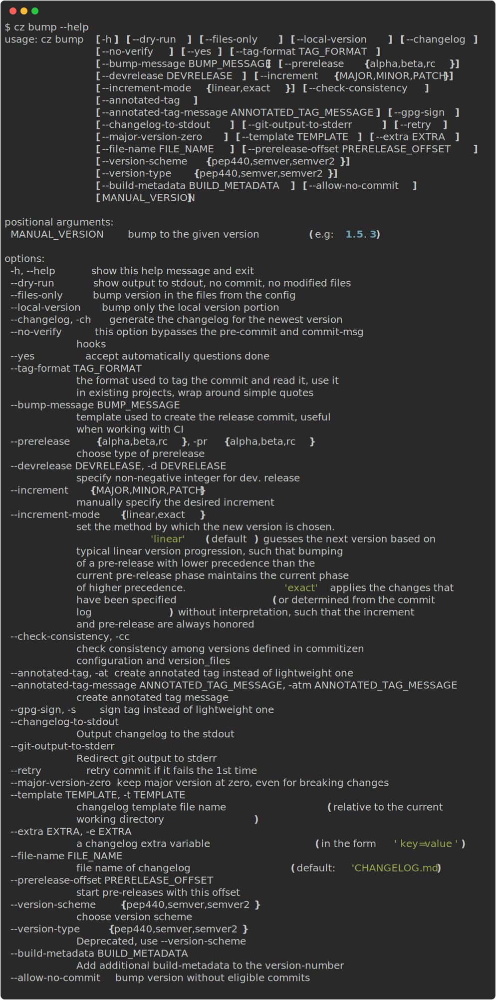

## About

`cz bump` is a powerful command that **automatically** determines and increases your project's version number based on your commit history.

It analyzes your commits to determine the appropriate version increment according to semantic versioning principles.

!!! note
    In the following documentation, the term "configuration file" refers to `pyproject.toml`, `.cz.toml` or other configuration files.

    We will use `pyproject.toml` as the configuration file throughout the documentation.

    See [Configuration file](../config/configuration_file.md) for more details.

## Key Features

- **Automatic Version Detection**: Analyzes commit history to determine the appropriate version bump
- **Manual Version Control**: Supports manual version specification when needed
- **Pre-release Support**: Handles alpha, beta, and release candidate versions
- **Multiple Version Schemes**: Supports both [PEP 440][pep440] and [semantic versioning][semver] formats

### Version Increment Rules

The version follows the `MAJOR.MINOR.PATCH` format, with increments determined by your commit types:

| Increment | Description                 | Conventional commit map |
| --------- | --------------------------- | ----------------------- |
| `MAJOR`   | Breaking changes introduced | `BREAKING CHANGE`, bang (e.g. `feat!`)|
| `MINOR`   | New features                | `feat`                  |
| `PATCH`   | Fixes and improvements      | `fix`, `perf`, `refactor`|

### `--version-scheme`

By default, Commitizen uses [PEP 440][pep440] for version formatting. You can switch to semantic versioning using either:

1. Command line:
```sh
cz bump --version-scheme semver
```

2. Configuration file:
```toml title="pyproject.toml"
[tool.commitizen]
version_scheme = "semver"
```

Available options are:

- `pep440`: [PEP 440][pep440] (**default** and recommended for Python projects)
- `semver`: [Semantic Versioning][semver] (recommended for non-Python projects)

You can also set this in the configuration file with `version_scheme = "semver"`.

!!! note
    [pep440][pep440] and [semver][semver] are quite similar, although their difference lies in
    how the prereleases look. For example, `0.3.1a0` in pep440 is equivalent to `0.3.1-a0` in semver.

    The following table illustrates the difference between the two schemes:

    | Version Type | pep440         | semver          |
    |--------------|----------------|-----------------|
    | Non-prerelease | `0.1.0`        | `0.1.0`         |
    | Prerelease     | `0.3.1a0`      | `0.3.1-a0`      |
    | Devrelease     | `0.1.1.dev1`   | `0.1.1-dev1`    |
    | Dev and pre    | `1.0.0a3.dev1` | `1.0.0-a3-dev1` |

### PEP440 Version Examples

Commitizen supports the [PEP 440][pep440] version format, which includes several version types. Here are examples of each:

#### Standard Releases
```text
0.9.0    # Initial development release
0.9.1    # Patch release
0.9.2    # Another patch release
0.9.10   # Tenth patch release
0.9.11   # Eleventh patch release
1.0.0    # First stable release
1.0.1    # Patch release after stable
1.1.0    # Minor feature release
2.0.0    # Major version release
```

#### Pre-releases
```text
1.0.0a0  # Alpha release 0
1.0.0a1  # Alpha release 1
1.0.0b0  # Beta release 0
1.0.0rc0 # Release candidate 0
1.0.0rc1 # Release candidate 1
```

#### Development Releases
```text
1.0.0.dev0  # Development release 0
1.0.0.dev1  # Development release 1
```

#### Combined Pre-release and Development
```text
1.0.0a1.dev0  # Development release 0 of alpha 1
1.0.0b2.dev1  # Development release 1 of beta 2
```

> **Note**: `post` releases (e.g., `1.0.0.post1`) are not currently supported.

## Command line options



### `--files-only`

Bumps the version in the files defined in [`version_files`][version_files] without creating a commit and tag on the git repository.

```bash
cz bump --files-only
```

### `--changelog`

Generate a **changelog** along with the new version and tag when bumping. See [changelog](./changelog.md) for more details.

```bash
cz bump --changelog
```

### `--prerelease`

The bump is a pre-release bump, meaning that in addition to a possible version bump the new version receives a
pre-release segment compatible with the bump's version scheme, where the segment consists of a _phase_ and a
non-negative number. Supported options for `--prerelease` are the following phase names `alpha`, `beta`, or
`rc` (release candidate). For more details, refer to the
[Python Packaging User Guide](https://packaging.python.org/en/latest/specifications/version-specifiers/#pre-releases).

Note that as per [semantic versioning spec](https://semver.org/#spec-item-9)

> Pre-release versions have a lower precedence than the associated normal version. A pre-release version
> indicates that the version is unstable and might not satisfy the intended compatibility requirements
> as denoted by its associated normal version.

For example, the following versions (using the [PEP 440](https://peps.python.org/pep-0440/) scheme) are ordered
by their precedence and showcase how a release might flow through a development cycle:

- `1.0.0` is the currently published version
- `1.0.1a0` after committing a `fix:` for pre-release
- `1.1.0a1` after committing an additional `feat:` for pre-release
- `1.1.0b0` after bumping a beta release
- `1.1.0rc0` after bumping the release candidate
- `1.1.0` next feature release

### `--increment-mode`

#### `--increment-mode=linear` (default)

Ensures that bumping pre-releases **maintains linearity**.

Bumping a pre-release with lower precedence than the current pre-release phase maintains the current phase of higher precedence.
For example, if the current version is `1.0.0b1` then bumping with `--prerelease alpha` will continue to bump the *beta* phase.

#### `--increment-mode=exact`

Applies the exact changes that have been specified with `--increment` or determined from the commit log.
For example, `--prerelease beta` will always result in a `b` tag, and `--increment PATCH` will always increase the patch component.

#### Examples

The following table illustrates the difference in behavior between the two modes:

| Increment | Pre-release | Start Version | `--increment-mode=linear` | `--increment-mode=exact` |
|-----------|-------------|---------------|---------------------------|--------------------------|
| `MAJOR`   |             | `2.0.0b0`     | `2.0.0`                   | `3.0.0`                  |
| `MINOR`   |             | `2.0.0b0`     | `2.0.0`                   | `2.1.0`                  |
| `PATCH`   |             | `2.0.0b0`     | `2.0.0`                   | `2.0.1`                  |
| `MAJOR`   | `alpha`     | `2.0.0b0`     | `3.0.0a0`                 | `3.0.0a0`                |
| `MINOR`   | `alpha`     | `2.0.0b0`     | `2.0.0b1`                 | `2.1.0a0`                |
| `PATCH`   | `alpha`     | `2.0.0b0`     | `2.0.0b1`                 | `2.0.1a0`                |

### `--check-consistency`

Check whether the versions defined in [version_files][version_files] and the version in Commitizen configuration are consistent before bumping version.

```bash
cz bump --check-consistency
```

For example, if we have the following configuration file `pyproject.toml`:

```toml title="pyproject.toml"
[tool.commitizen]
version = "1.21.0"
version_files = [
    "src/__version__.py",
    "setup.py",
]
```

and the following version files `src/__version__.py` and `setup.py`:

```python title="src/__version__.py"
__version__ = "1.21.0"
```

```python title="setup.py"
from setuptools import setup

setup(..., version="1.0.5", ...)
```

When you run `cz bump --check-consistency`, Commitizen will verify that the current version in `pyproject.toml` (`1.21.0`) exists in all files listed in [version_files][version_files].
In this example, it will detect that `setup.py` contains `1.0.5` instead of `1.21.0`, causing the bump to fail.

!!! warning "Partial updates on failure"
    If the consistency check fails, Commitizen may have already updated some files (like `pyproject.toml` and `src/__version__.py`) before detecting the inconsistency.
    In this case, you'll need to restore the files to their previous state.

    To resolve this issue:

    1. Restore the modified files to their previous state:
      ```bash
      git checkout .
      ```

    2. Manually update the version in `setup.py` to match the version in `pyproject.toml`:
      ```diff title="setup.py"
      from setuptools import setup

      - setup(..., version="1.0.5", ...)
      + setup(..., version="1.21.0", ...)
      ```

    3. Run the bump command again:
      ```bash
      cz bump --check-consistency
      ```

### `--local-version`

Bump the local portion of the version.

For example, if we have the following configuration file `pyproject.toml`:

```toml title="pyproject.toml"
[tool.commitizen]
version = "5.3.5+0.1.0"
```

When you run `cz bump --local-version`, it will bump only the local version `0.1.0` and keep the public version `5.3.5` intact, bumping to the version `5.3.5+0.2.0`.

### `--annotated-tag`

Create annotated tags.

It is also available via configuration files.

For example, in `pyproject.toml`:

```toml title="pyproject.toml"
[tool.commitizen]
annotated_tag = true
```

!!! note
    By default, Commitizen uses lightweight tags.

### `--annotated-tag-message`

Create annotated tags with the given message.

It is also available via configuration files.

For example, in `pyproject.toml`:

```toml title="pyproject.toml"
[tool.commitizen]
annotated_tag_message = "Annotated tag message"
```

### `--changelog-to-stdout`

Send the incremental changelog generated by `cz bump` to `stdout`.
Any other messages generated by `cz bump` will be sent to `stderr`.

When this flag is used, `--changelog` is implied.
However, it is recommended to set `--changelog` (or the setting `update_changelog_on_bump`) explicitly when the option `--changelog-to-stdout` is used.

!!! note "Useful scenarios"
    Pipe the newly created changelog to another tool.

    The output can be redirected to an auditing system, or used to create a GitHub Release, etc.

    ```bash
    cz bump --changelog --changelog-to-stdout > body.md
    ```

### `--git-output-to-stderr`

Redirects git commands output to `stderr`.

Useful when used with `--changelog-to-stdout` and piping the output to a file.

For example, `git commit` output may pollute `stdout`, so it is recommended to use this flag when piping the output to a file.

### `--retry`

If you use tools like [pre-commit](https://pre-commit.com/), you can add this flag.
It will retry the commit if it fails the first time.

Useful to combine with code formatters, like [Prettier](https://prettier.io/).

### `--major-version-zero`

Breaking changes do not bump the major version number.

Say you have a project with the version `0.1.x` and you commit a breaking change like this:

```text
fix(magic)!: fully deprecate whatever
```

and you run

```bash
cz bump --major-version-zero
```

Then the version of your project will be bumped to `0.2.0` instead of `1.0.0`.

!!! note
    A project in its initial development should have a major version zero,
    and even breaking changes should not bump that major version from zero. This command ensures that behavior.

    We recommend setting `major_version_zero = true` in your configuration file while a project
    is in its initial development. Remove that configuration using a breaking-change commit to bump
    your project's major version to `v1.0.0` once your project has reached maturity.

!!! warning
    This option is only compatible with projects that have major version number zero, `0.x.x` for example.

    It fails when used with projects that have a version number greater than zero like `1.x.x`.

    If used together with a manual version, the command also fails.

    ```bash
    # This fails
    cz bump 0.1.0 --major-version-zero
    ```

### `--gpg-sign`

Creates gpg signed tags.

```bash
cz bump --gpg-sign
```

!!! note
    By default, Commitizen uses lightweight tags.

### `--template`

Provides your own changelog jinja template.
See [the template customization section](../customization/changelog_template.md)

### `--extra`

Provides your own changelog extra variables by using the `extras` settings or the `--extra/-e` parameter.

```bash
cz bump --changelog --extra key=value -e short="quoted value"
```

See [the template customization section](../customization/changelog_template.md).

### `--build-metadata`

Specifies additional metadata in the version string.

```bash
# creates a version like `1.1.2+yourmetadata`.
cz bump --build-metadata yourmetadata
```

!!! note "Example usage"
    - Git hash in version
    - Labeling the version with additional metadata.

!!! note
    Commitizen ignores everything after `+` when it bumps the version.

    It is therefore safe to write different build-metadata between versions.


!!! warning
    Normally, you should not use this functionality, but if you decide to do so, keep in mind that:

    - Version `1.2.3+a`, and `1.2.3+b` are the same version! Tools should not use the string after `+` for version calculation. This is probably not a guarantee (example in helm) even tho it is in the spec.
    - It might be problematic having the metadata in place when doing upgrades depending on what tool you use.

!!! warning
    This parameter is not compatible with `--local-version` as it uses the same part of the version string.

### `--get-next`

Similar to `--dry-run` but only outputs the next version.

```bash
# outputs 1.0.1 if the current version is 1.0.0 and the increment is PATCH
cz bump --get-next
```

Useful for determining the next version based on CI for non-production environments/builds.

!!! note "Compare with `--dry-run`"
    `--dry-run` provides a more detailed output including the changes as they would appear in the changelog file, while `--get-next` only outputs the next version.

    The following is the output of `cz bump --dry-run`:

    ```text
    bump: version 3.28.0 → 3.29.0
    tag to create: v3.29.0
    increment detected: MINOR
    ```

    The following is the output of `cz bump --get-next`:

    ```text
    3.29.0
    ```

!!! warning
    The `--get-next` flag will raise a `NoneIncrementExit` if the found commits are not eligible for a version bump.

    For information on how to suppress this exit, see [Ignoring Exit Codes](../exit_codes.md#ignoring-exit-codes).

### `--allow-no-commit`

Allow the project version to be bumped even when there's no eligible version.

Example usage:

```sh
# Force to bump a minor version
cz bump --increment MINOR --allow-no-commit

# bump version to 2.0.0 even when there's no breaking changes or even no commits
cz bump --allow-no-commit 2.0.0
```

!!! note "Default increment"
    The increment is overridden to `PATCH` if there is no increment detected or specified.

    In other words, `cz bump --allow-no-commit` allows you to bump the version to the next patch version even when there is no eligible commit.

    ```sh
    # will bump to `1.0.1` if the current version is `1.0.0`.
    cz bump --allow-no-commit

    # bump version to 2.0.0 even when there's no breaking changes or even no commits
    cz bump --allow-no-commit 2.0.0
    ```

### `--tag-format`

`tag_format` and [version_scheme][version_scheme] are combined to make Git tag names from versions.

These are used in:

- `cz bump`: Find previous release tag (exact match) and generate new tag.
- Find previous release tags in `cz changelog`.
  - If `--incremental`: Using the latest version found in the changelog, scan existing Git tags with 89\% similarity match.
  - `--rev-range` is converted to Git tag names with `tag_format` before searching Git history.
- If the `scm` `version_provider` is used, it uses different regexes to find the previous version tags:
  - If `tag_format` is set to `$version` (default): `VersionProtocol.parser` (allows `v` prefix)
  - If `tag_format` is set: Custom regex similar to SemVer (not as lenient as PEP440 e.g. on dev-releases)

Commitizen supports two types of formats, a simple and a more complex.

```bash
cz bump --tag-format="v$version"
```

```bash
cz bump --tag-format="v$minor.$major.$patch$prerelease.$devrelease"
```

In your configuration file:

```toml
[tool.commitizen]
tag_format = "v$major.$minor.$patch$prerelease"
```

The variables must be preceded by a `$` sign and optionally can be wrapped in `{}`. The default is `$version`.

Supported variables:

| Variable                       | Description                                 |
|--------------------------------|---------------------------------------------|
| `$version`, `${version}`       | fully generated version                     |
| `$major`, `${major}`           | MAJOR increment                             |
| `$minor`, `${minor}`           | MINOR increment                             |
| `$patch`, `${patch}`           | PATCH increment                             |
| `$prerelease`, `${prerelease}` | Prerelease (alpha, beta, release candidate) |
| `$devrelease`, `${devrelease}` | Development release                         |

### `--yes`

Automatically answers “yes” to all interactive prompts during the bump process, allowing the command to run without manual confirmation.

```bash
cz bump --yes
```

[pep440]: https://www.python.org/dev/peps/pep-0440/
[semver]: https://semver.org/
[version_files]: ../config/bump.md#version_files
