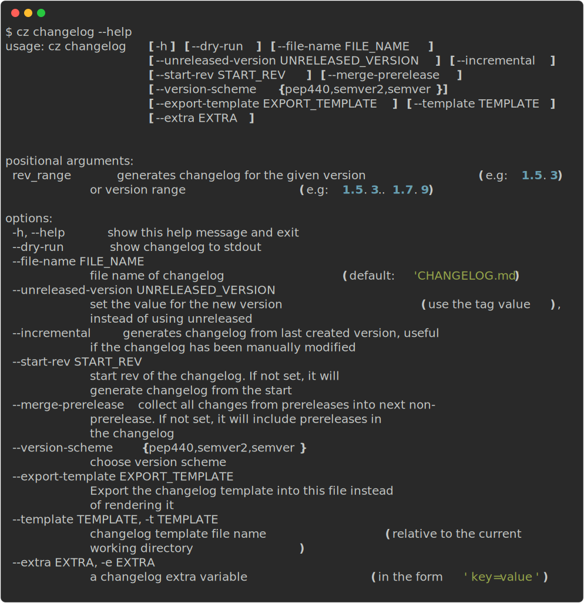

## About

Generates a changelog following the committing rules established.

!!! tip
    To create the changelog automatically on bump, add the setting [update_changelog_on_bump](../config/bump.md#update_changelog_on_bump)

    ```toml
    [tool.commitizen]
    update_changelog_on_bump = true
    ```

## Usage



## Examples

```bash
# Generate full changelog
cz changelog

# Or use the alias
cz ch

# Get the changelog for the given version
cz changelog 0.3.0 --dry-run

# Get the changelog for the given version range
cz changelog 0.3.0..0.4.0 --dry-run
```

## Constraints

Changelog generation is constrained only to **markdown** files.

## Description

These are the variables used by the changelog generator.

```md
# <version> (<date>)

## <change_type>

- **<scope>**: <message>
```

Creates a full block like above per version found in the tags, and a list of the commits found.
The `change_type` and `scope` are optional and don't need to be provided,
but if your regex parses them, they will be rendered.

The format followed by the changelog is from [keep a changelog][keepachangelog]
and the following variables are expected:

| Variable      | Description                                                                                    | Source         |
| ------------- | ---------------------------------------------------------------------------------------------- | -------------- |
| `version`     | Version number which should follow [semver][semver]                                            | `tags`         |
| `date`        | Date when the tag was created                                                                   | `tags`         |
| `change_type` | The group where the commit belongs to, this is optional. Example: fix                          | `commit regex` |
| `message`   | Information extracted from the commit message                                                  | `commit regex` |
| `scope`       | Contextual information. Should be parsed using the regex from the message, it will be **bold** | `commit regex` |
| `breaking`    | Whether it is a breaking change or not                                                          | `commit regex` |

!!! note
    `message` is the only variable required to be parsed by the regex.

## Command line options

### `--extras`

Provide your own changelog extra variables by using the `extras` settings or the `--extra/-e` parameter.

```bash
cz changelog --extra key=value -e short="quoted value"
```

### `--file-name`

This value can be updated in the configuration file with the key `changelog_file` under `tool.commitizen`.

Specify the name of the output file. Note that changelog generation only works with Markdown files.

```bash
cz changelog --file-name="CHANGES.md"
```

### `--incremental`

This flag can be set in the configuration file with the key `changelog_incremental` under `tool.commitizen`

Benefits:

- Build from the latest version found in changelog. This is useful if you have an existing changelog and want to use commitizen to extend it.
- Update unreleased area
- Allows users to manually edit the changelog without it being completely rewritten.

```bash
cz changelog --incremental
```

```toml
[tool.commitizen]
# ...
changelog_incremental = true
```

### `--start-rev`

This value can be set in the configuration file with the key `changelog_start_rev` under `tool.commitizen`

Start from a given git rev to generate the changelog. Commits before that rev will not be considered. This is especially useful for long-running projects adopting conventional commits, where old commit messages might fail to be parsed for changelog generation.

```bash
cz changelog --start-rev="v0.2.0"
```

```toml
[tool.commitizen]
# ...
changelog_start_rev = "v0.2.0"
```

### `--merge-prerelease`

This flag can be set in the configuration file with the key `changelog_merge_prerelease` under `tool.commitizen`

Collects changes from prereleases into the next non-prerelease version. If you have a prerelease version followed by a normal release, the changelog will show the prerelease changes as part of the normal release. If not set, prereleases will be included as separate entries in the changelog.

```bash
cz changelog --merge-prerelease
```

```toml
[tool.commitizen]
# ...
changelog_merge_prerelease = true
```

### `--template`

Provide your own changelog Jinja template by using the `template` settings or the `--template` parameter.

```bash
cz changelog --template="path/to/template.j2"
```

### `--unreleased-version`

There is usually a chicken-and-egg situation when automatically bumping the version and creating the changelog:

- If you bump the version first, you have no changelog yet, and it won't be included in the release of the created version.
- If you create the changelog before bumping the version, you usually don't have the latest tag, and the _Unreleased_ title appears.

By using `--unreleased-version`, you can prevent this situation.

Before bumping you can run:

```bash
cz changelog --unreleased-version="v1.0.0"
```

Remember to use the tag format instead of the raw version number.

For example, if your tag format includes a `v` prefix (e.g., `v1.0.0`), use that format. If your tag is the same as the raw version (e.g., `1.0.0`), use the raw version.

Alternatively, you can directly bump the version and create the changelog by running:

```bash
cz bump --changelog
```

## Hooks

Supported hook methods:

- Per parsed message: Useful to add links to commits or issues
- End of changelog generation: Useful to send Slack or chat messages, or notify another department

Read more about hooks in the [customization page][customization]

[keepachangelog]: https://keepachangelog.com/
[semver]: https://semver.org/
[customization]: ../customization/config_file.md
