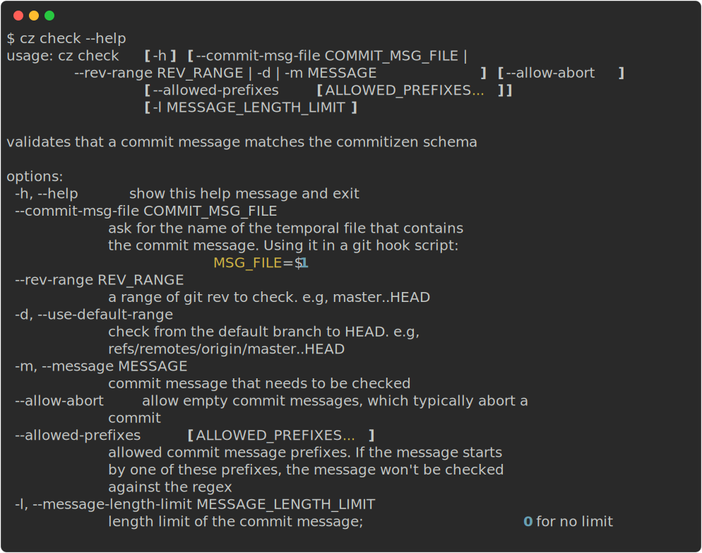

# Check

## About

This feature checks whether the commit message follows the given committing rules. Comments in git messages will be ignored.

If you want to set up an automatic check before every git commit, please refer to
[Automatically check message before commit](../tutorials/auto_check.md).

## Usage



There are three mutually exclusive ways to use `cz check`:

- with `--rev-range` to check a range of pre-existing commits
- with `--message` or by piping the message to it to check a given string
- or with `--commit-msg-file` to read the commit message from a file

### Git Rev Range

If you'd like to check a commit's message after it has already been created, then you can specify the range of commits to check with `--rev-range REV_RANGE`.

```bash
$ cz check --rev-range REV_RANGE
```

For example, if you'd like to check all commits on a branch, you can use `--rev-range master..HEAD`. Or, if you'd like to check all commits starting from when you first implemented commit message linting, you can use `--rev-range <first_commit_sha>..HEAD`.

For more information on how git commit ranges work, you can check the [git documentation](https://git-scm.com/book/en/v2/Git-Tools-Revision-Selection#_commit_ranges).

### Commit Message

There are two ways you can provide your plain message and check it.

#### Method 1: use -m or --message

```bash
$ cz check --message MESSAGE
```

In this option, MESSAGE is the commit message to be checked.

#### Method 2: use pipe to pipe it to `cz check`

```bash
$ echo MESSAGE | cz check
```

In this option, MESSAGE is piped to cz check and will be checked.

### Commit Message File

```bash
$ cz check --commit-msg-file COMMIT_MSG_FILE
```

In this option, COMMIT_MSG_FILE is the path of the temporary file that contains the commit message.
This argument can be useful when cooperating with git hooks. Please check [Automatically check message before commit](../tutorials/auto_check.md) for more information about how to use this argument with git hooks.

### Allow Abort

```bash
cz check --message MESSAGE --allow-abort
```

Empty commit messages typically instruct Git to abort a commit, so you can pass `--allow-abort` to
permit them. Since `git commit` accepts an `--allow-empty-message` flag (primarily for wrapper scripts), you may wish to disallow such commits in CI. `--allow-abort` may be used in conjunction with any of the other options.

### Allowed Prefixes

If the commit message starts with some specific prefixes, `cz check` returns `True` without checking the regex.
By default, the following prefixes are allowed: `Merge`, `Revert`, `Pull request`, `fixup!` and `squash!`.

```bash
cz check --message MESSAGE --allowed-prefixes 'Merge' 'Revert' 'Custom Prefix'
```

### Commit message length limit

The argument `-l` (or `--message-length-limit`) followed by a positive number can limit the length of commit messages.
For example, `cz check --message MESSAGE -l 3` would fail the check, since `MESSAGE` is more than 3 characters long.
By default, the limit is set to 0, which means no limit on the length.

**Note that the limit applies only to the first line of the message.**
Specifically, for `ConventionalCommitsCz` the length only counts from the type of change to the subject,
while the body and the footer are not counted.
