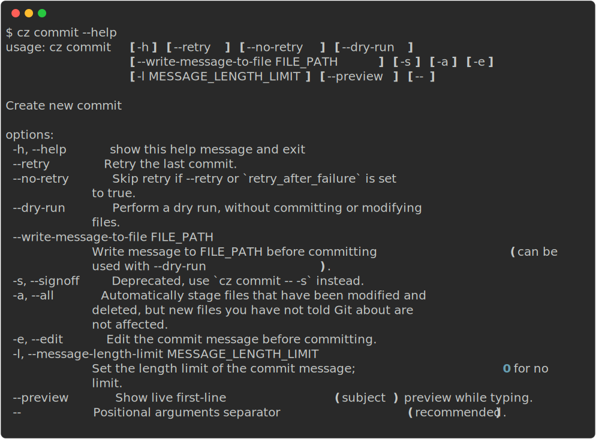

## Usage



## Overview


The `commit` command provides an interactive way to create structured commits. Use either:

- `cz commit`
- `cz c` (shortcut)

By default, Commitizen uses conventional commits, but you can customize the commit rules to match your project's needs. See the [customization guide](../customization.md) for details.

## Basic Usage

### Interactive Commit Creation

Simply run `cz commit` in your terminal to start the interactive commit creation process. The command will guide you through creating a properly formatted commit message according to your configured rules.

### Writing Messages to File

You can save the generated commit message to a file using:
```sh
cz commit --write-message-to-file COMMIT_MSG_FILE
```

This can be combined with `--dry-run` to only write the message without creating a commit. This is particularly useful for [automatically preparing commit messages](../tutorials/auto_prepare_commit_message.md).

## Advanced Features

### Git Command Options

You can pass any git commit options using the `--` syntax:
```sh
cz commit <commitizen-args> -- <git-cli-args>

# Examples:
cz c --dry-run -- -a -S  # Stage all changes and sign the commit
cz c -a -- -n            # Stage all changes and skip the pre-commit and commit-msg hooks
```

!!! warning
    The `--signoff` option (or `-s`) is now recommended being used with the new syntax: `cz commit -- -s`. The old syntax `cz commit --signoff` is deprecated and will be removed in v5.

### Retry

- Use `cz commit --retry` to reuse the last commit message after a failed commit attempt
- Set `retry_after_failure: true` in your configuration to automatically retry
- Use `cz commit --no-retry` to force a new commit message prompt

### Message Length Control

Control the length of your commit messages using the `-l` or `--message-length-limit` option:
```sh
cz commit -l 72  # Limits message length to 72 characters
```

!!! note
    The length limit only applies to the first line of the commit message. For conventional commits, this means the limit applies from the type of change through the subject. The body and footer are not counted.

## Technical Notes

For platform compatibility, the `commit` command disables ANSI escaping in its output. This means pre-commit hooks coloring will be deactivated as discussed in [commitizen-tools/commitizen#417](https://github.com/commitizen-tools/commitizen/issues/417).
