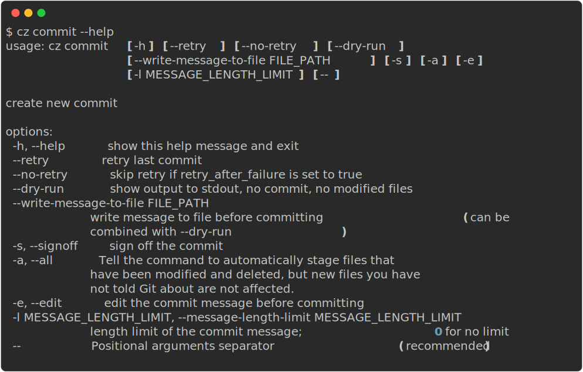

## About

In your terminal run `cz commit` or the shortcut `cz c` to generate a guided git commit.

You can run `cz commit --write-message-to-file COMMIT_MSG_FILE` to additionally save the
generated message to a file. This can be combined with the `--dry-run` flag to only
write the message to a file and not modify files and create a commit. A possible use
case for this is to [automatically prepare a commit message](../tutorials/auto_prepare_commit_message.md).


!!! note
    To maintain platform compatibility, the `commit` command disable ANSI escaping in its output.
    In particular pre-commit hooks coloring will be deactivated as discussed in [commitizen-tools/commitizen#417](https://github.com/commitizen-tools/commitizen/issues/417).

## Usage



### git options

`git` command options that are not implemented by commitizen can be use via the `--` syntax for the `commit` command.
The syntax separates commitizen arguments from `git commit` arguments by a double dash. This is the resulting syntax:
```sh
cz commit <commitizen-args> -- <git-cli-args>

# e.g., cz commit --dry-run -- -a -S
```
For example, using the `-S` option on `git commit` to sign a commit is now commitizen compatible: `cz c -- -S`

!!! note
    Deprecation warning: A commit can be signed off using `cz commit --signoff` or the shortcut `cz commit -s`.
    This syntax is now deprecated in favor of the new `cz commit -- -s` syntax.

### Retry

You can use `cz commit --retry` to reuse the last commit message when the previous commit attempt failed.
To automatically retry when running `cz commit`, you can set the `retry_after_failure`
configuration option to `true`. Running `cz commit --no-retry` makes commitizen ignore `retry_after_failure`, forcing
a new commit message to be prompted.

### Commit message length limit

The argument `-l` (or `--message-length-limit`) followed by a positive number can limit the length of commit messages.
An exception would be raised when the message length exceeds the limit.
For example, `cz commit -l 72` will limit the length of commit messages to 72 characters.
By default the limit is set to 0, which means no limit on the length.

**Note that the limit applies only to the first line of the message.**
Specifically, for `ConventionalCommitsCz` the length only counts from the type of change to the subject,
while the body and the footer are not counted.
