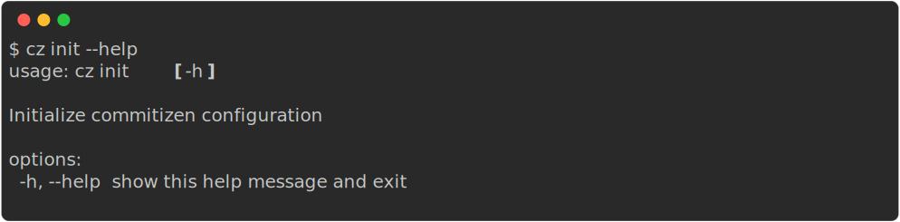

The `cz init` command helps you set up Commitizen in your project by creating a configuration file with your preferred settings.

## Usage



## Command

```sh
cz init
```

## Interactive Configuration

When you run `cz init`, Commitizen will guide you through an interactive setup process:


## Configuration File

The initialization process will create a configuration file in your project root.

Choose the configuration file format based on your project type:

- Use `pyproject.toml` for Python projects
- Use `.cz.toml`, `.cz.yaml`, `.cz.json`, etc. for other projects.

## Configuration Options

During the initialization process, you'll be prompted to configure the following settings:

1. **Convention Rules**: Select the commit message convention to follow (e.g., conventional commits)
2. **Version Provider**: Choose how to manage versioning in your project. Commitizen supports multiple version management systems:
    - `commitizen`: Uses Commitizen's built-in version management system
    - `npm`: Manages version in `package.json` for Node.js projects
    - `cargo`: Manages version in `Cargo.toml` for Rust projects
    - `composer`: Manages version in `composer.json` for PHP projects
    - `pep621`: Uses `pyproject.toml` with PEP 621 standard
    - `poetry`: Uses `pyproject.toml` with Poetry configuration
    - `uv`: Uses `pyproject.toml` and `uv.lock` for Python projects
    - `scm`: Reads version directly from git tags without modifying files
3. **Project Version**: The current version of your project will be detected automatically
4. **Tag Format**: The format used for version tags in your repository
5. **Version Type**: Choose between:
    - `semver` or `semver2`: Semantic Versioning (MAJOR.MINOR.PATCH)
    - `pep440`: Python Package Versioning
6. **Changelog Generation**: Configure whether to automatically generate changelog during version bumps
7. **Alpha Versioning**: Option to keep major version at 0 for alpha/beta software
8. **Pre-commit Hooks**: Set up Git pre-commit hooks for automated commit message validation

## Example

```sh
# Start the initialization process
cz init

# Follow the interactive prompts to configure your project
```

## Next Steps

After initialization, you can:

1. Start using `cz commit` to create conventional commits
2. Use `cz bump` to manage versioning
3. Configure additional settings in your project's configuration file
