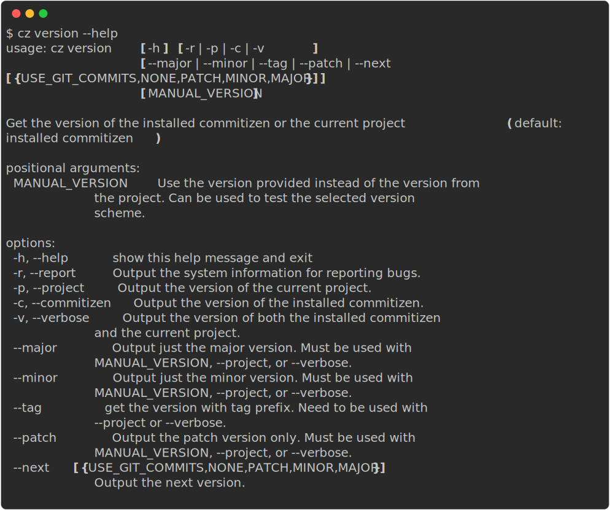

Get the version of the installed Commitizen or the current project (default: installed commitizen).

## Usage



## Project version and scheme

- **`cz version --project`** prints the version from your configured [version provider](../config/version_provider.md).
- **`cz version MANUAL_VERSION`** (optional positional) uses that string instead of the provider, so you can try how your configured scheme parses and formats it.

## Components and next version

- **`--major`**, **`--minor`**, **`--patch`**: print only that component of the (possibly manual) project version. Requires `--project`, `--verbose`, or a manual version.
- **`--next` `[MAJOR|MINOR|PATCH|NONE]`**: print the version after applying that bump to the current project or manual version. `NONE` leaves the version unchanged.
- **`--tag`**: print the version formatted with your `tag_format` (requires `--project` or `--verbose`).

`--next USE_GIT_COMMITS` is reserved for a future feature (derive the bump from git history) and is not implemented yet.

## Examples

```bash
cz version --project
cz version 2.0.0 --next MAJOR
cz version --project --major
cz version --verbose
```
