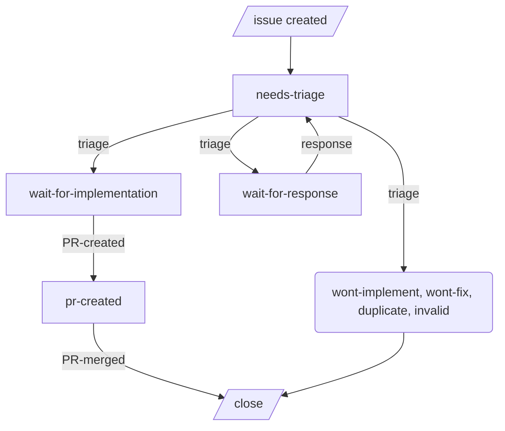
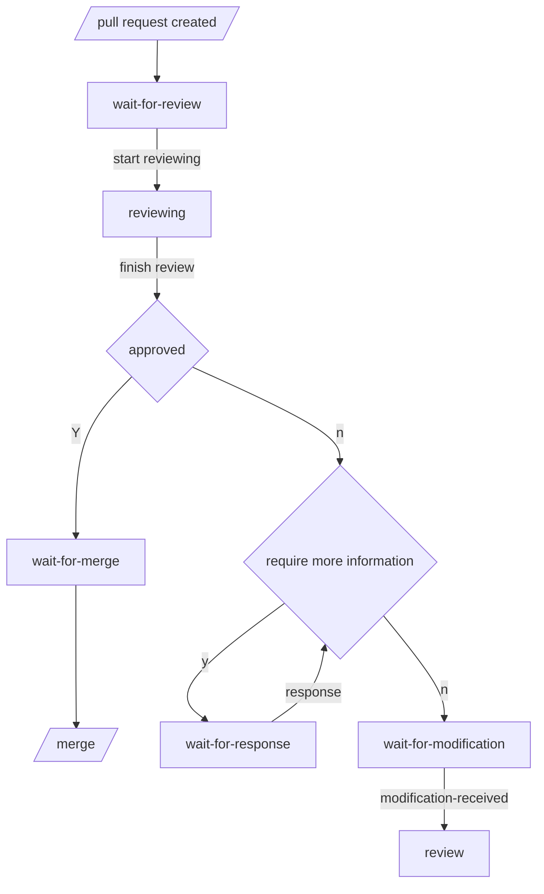

## Contributing to commitizen

First of all, thank you for taking the time to contribute! 🎉

When contributing to [commitizen](https://github.com/commitizen-tools/commitizen), please first create an [issue](https://github.com/commitizen-tools/commitizen/issues) to discuss the change you wish to make before making a change.

If you're a first-time contributor, you can check the issues with [good first issue](https://github.com/commitizen-tools/commitizen/issues?q=is%3Aissue+is%3Aopen+label%3A%22good+first+issue%22) tag.

## Install before contributing

1. Install [poetry](https://python-poetry.org/) `1.2.0+`, installation [pages](https://python-poetry.org/docs/#installing-with-the-official-installer)
2. Install [gpg](https://gnupg.org), installation [pages](https://gnupg.org/documentation/manuals/gnupg/Installation.html#Installation). For Mac users, you could try [homebrew](https://brew.sh/).

## Before making a pull request

1. Fork [the repository](https://github.com/commitizen-tools/commitizen).
2. Clone the repository from your GitHub.
3. Setup development environment through [poetry](https://python-poetry.org/) (`poetry install`).
4. Setup [pre-commit](https://pre-commit.com/) hook (`poetry run pre-commit install`)
5. Check out a new branch and add your modification.
6. Add test cases for all your changes.
   (We use [CodeCov](https://codecov.io/) to ensure our test coverage does not drop.)
7. Use [commitizen](https://github.com/commitizen-tools/commitizen) to do git commit. We follow [conventional commits](https://www.conventionalcommits.org/).
8. Run `./scripts/format` and `./scripts/test` to ensure you follow the coding style and the tests pass.
9. Optionally, update the `./docs/README.md`.
9. **Do not** update the `CHANGELOG.md`, it will be automatically created after merging to `master`.
10. **Do not** update the versions in the project, they will be automatically updated.
10. If your changes are about documentation. Run `poetry run mkdocs serve` to serve documentation locally and check whether there is any warning or error.
11. Send a [pull request](https://github.com/commitizen-tools/commitizen/pulls) 🙏

## Use of GitHub Labels

* good-first-issue *(issue only)*
* help-wanted
* issue-status: needs-triage *(issue only)* **(default label for issues)**
* issue-status: wont-fix
* issue-status: wont-implement
* issue-status: duplicate
* issue-status: invalid
* issue-status: wait-for-response
* issue-status: wait-for-implementation
* issue-status: pr-created
* pr-status: wait-for-review **(default label for PRs)**
* pr-status: reviewing
* pr-status: wait-for-modification
* pr-status: wait-for-response
* pr-status: ready-to-merge
* needs: test-case *(pr only)*
* needs: documentation *(pr only)*
* type: feature
* type: bug
* type: documentation
* type: refactor
* type: question *(issue only)*
* os: Windows
* os: Linux
* os: macOS

### Issue life cycle

### Pull request life cycle

[conventional-commmits]: https://www.conventionalcommits.org/
