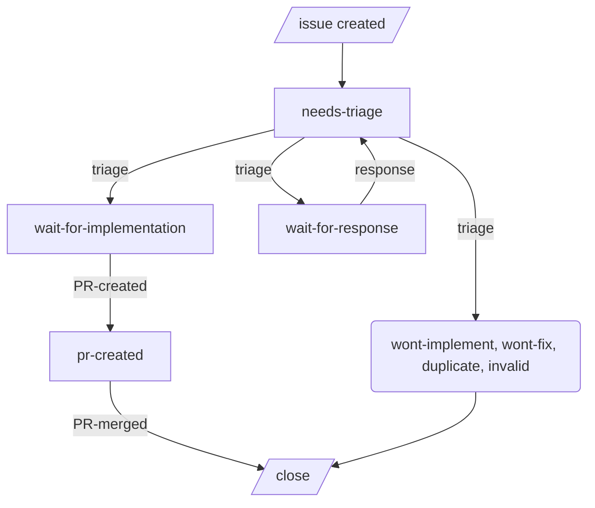
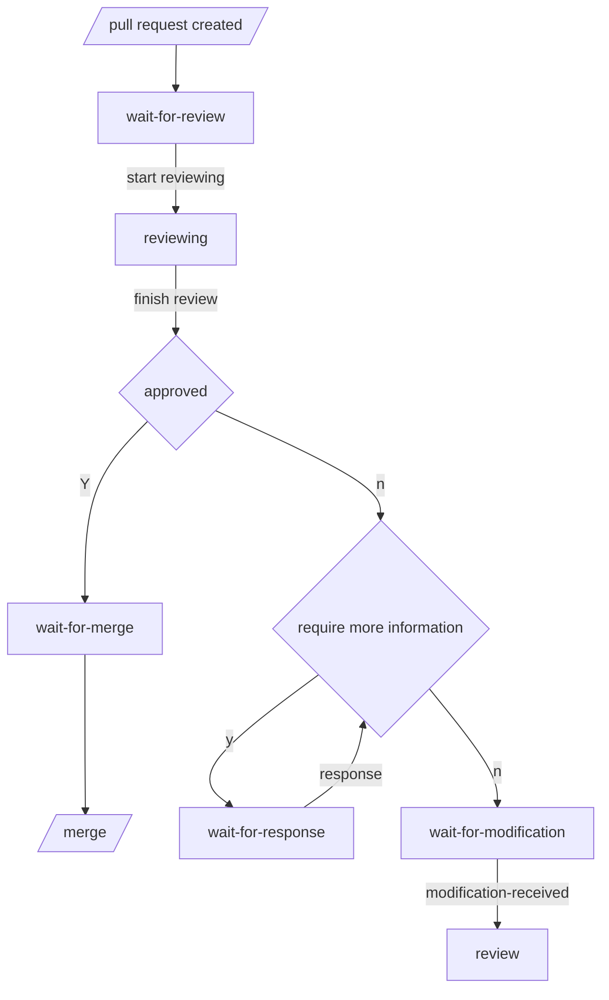

# Contributing to Commitizen

First, thank you for taking the time to contribute! 🎉 Your contributions help make Commitizen better for everyone.

When contributing to Commitizen, we encourage you to:

1. First, check out the [issues](https://github.com/commitizen-tools/commitizen/issues) and [Features we won't add](../features_wont_add.md) to see if there's already a discussion about the change you wish to make.
2. If there's no discussion, [create an issue](https://github.com/commitizen-tools/commitizen/issues/new) to discuss your proposed changes.
3. Follow our [development workflow](#development-workflow) and guidelines below.

If you're a first-time contributor, please check out issues labeled [good first issue](https://github.com/commitizen-tools/commitizen/issues?q=is%3Aissue+is%3Aopen+label%3A%22good+first+issue%22) - these are specifically chosen to be beginner-friendly.

## Prerequisites & Setup

### Required Tools

1. **Python Environment**
    - Python `>=3.10`
    - [uv](https://docs.astral.sh/uv/getting-started/installation/) `>=0.9.0`
2. **Version Control & Security**
    - Git
    - Commitizen
    - [GPG](https://gnupg.org) for commit signing
        - [Installation page](https://gnupg.org/documentation/manuals/gnupg/Installation.html#Installation)
        - For Mac users: `brew install gnupg`
        - For Windows users: Download from [Gpg4win](https://www.gpg4win.org/)
        - For Linux users: Use your distribution's package manager (e.g., `apt install gnupg` for Ubuntu)

### Getting Started

1. Fork [Commitizen](https://github.com/commitizen-tools/commitizen)
2. Clone your fork:
    ```bash
    git clone https://github.com/YOUR_USERNAME/commitizen.git
    cd commitizen
    ```
3. Add the upstream repository:
    ```bash
    git remote add upstream https://github.com/commitizen-tools/commitizen.git
    ```
4. Set up the development environment:
    ```bash
    uv sync --dev --frozen
    ```
5. Set up pre-commit hooks:
    ```bash
    uv run poe setup-pre-commit
    ```

## Development Workflow

1. **Create a New Branch**
    ```bash
    git switch -c feature/your-feature-name
    # or
    git switch -c fix/your-bug-fix
    ```
2. **Make Your Changes**
    - Write your code
    - Add tests for new functionalities or fixes
    - Update documentation if needed
    - Follow the existing code style
3. **Testing**
    - Run the full test suite: `uv run poe all`
    - Ensure test coverage doesn't drop (we use [CodeCov](https://app.codecov.io/gh/commitizen-tools/commitizen))
    - For documentation changes, run `uv run poe doc` to check for warnings/errors
    - If you need to change some file regression snapshots, run: `uv run poe test:regen`
4. **Committing Changes**
    - Use Commitizen to make commits (we follow [conventional commits](https://www.conventionalcommits.org/))
    - Example: `cz commit`
5. **Documentation**
    - Update `docs/README.md` if needed
    - For CLI help screenshots: `uv run poe doc:screenshots`
    - Prefer [Google style documentation](https://github.com/google/styleguide/blob/gh-pages/pyguide.md#38-comments-and-docstrings), which works well with editors like VSCode and PyCharm
    - **DO NOT** update `CHANGELOG.md` (automatically generated)
    - **DO NOT** update version numbers (automatically handled)
6. **Pull Request**
    - Push your changes: `git push origin your-branch-name`
    - Create a pull request on GitHub
    - Ensure CI checks pass
    - Wait for review and address any feedback

## Use of GitHub Labels

* good-first-issue *(issue only)*
* help-wanted
* issue-status: needs-triage *(issue only)* **(default label for issues)**
* issue-status: wont-fix
* issue-status: wont-implement
* issue-status: duplicate
* issue-status: invalid
* issue-status: wait-for-response
* issue-status: wait-for-implementation
* issue-status: pr-created
* pr-status: wait-for-review **(default label for PRs)**
* pr-status: reviewing
* pr-status: wait-for-modification
* pr-status: wait-for-response
* pr-status: ready-to-merge
* needs: test-case *(PR only)*
* needs: documentation *(PR only)*
* type: feature
* type: bug
* type: documentation
* type: refactor
* type: question *(issue only)*
* os: Windows
* os: Linux
* os: macOS


## Issue life cycle



## Pull request life cycle


