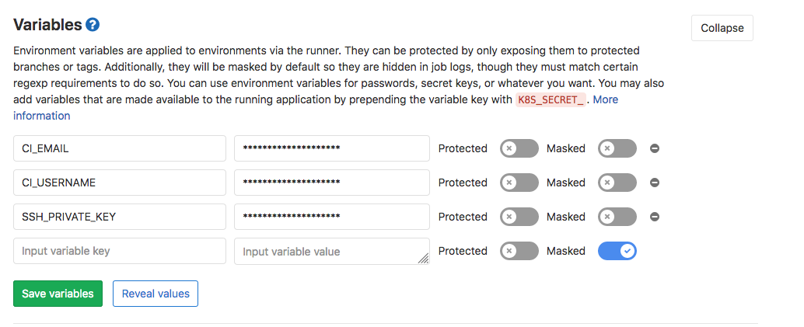
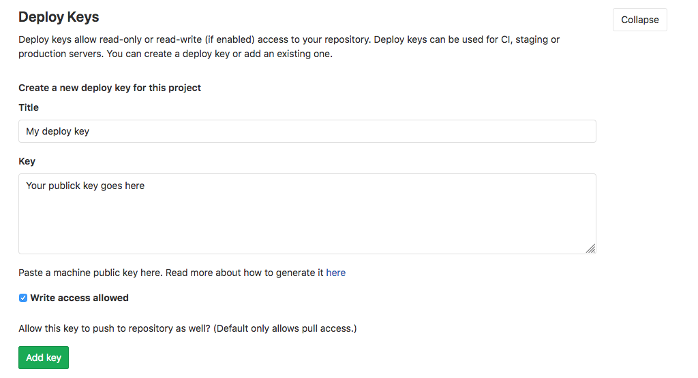

## Create a new release using GitLab CI

For this example, we have a `python/django` application and `Docker` as a containerization tool.

_Goal_: Bump a new version every time that a change occurs on the `master` branch. The bump should be executed automatically by the `CI` process.

### Development Workflow

1. A developer creates a new commit on any branch (except `master`)
2. A developer creates a merge request (MR) against `master` branch
3. When the `MR` is merged into master, the 2 stages of the CI are executed
4. For simplification, we store the software version in a file called `VERSION`. You can use any file that you want as `commitizen` supports it.
5. The commit message executed automatically by the `CI` must include `[skip-ci]` in the message; otherwise, the process will generate a loop. You can define the message structure in [commitizen](../commands/bump.md) as well.

### GitLab Configuration

To be able to change files and push new changes with `GitLab CI` runners, we need to have a `ssh` key and configure a git user.

First, let's create a `ssh key`. The only requirement is to create it without a passphrase:

```bash
ssh-keygen -f deploy_key -N ""
```

The previous command will create a private and public key under the files `deploy_key` and `deploy_key.pub`. We will use them later.

For the git user, we need an email and username. You can choose whatever you want; in this example, we choose `ci-runner@myproject.com` and `admin`, respectively.

Now, we need to create three environment variables that will be visible for the runners. They should be created in the `variables` section under `settings/ci_cd`:



Create `SSH_PRIVATE_KEY`, `CI_EMAIL`, `CI_USERNAME` variables, and fill them with the `private_key`, `email` and `username` that we have created previously.

The latest step is to create a `deploy key.` To do this, we should create it under the section `settings/repository` and fill it with the `public key` generated before. Check `Write access allowed`; otherwise, the runner won't be able to write the changes to the repository.



If you have more projects under the same organization, you can reuse the deploy key created before, but you will have to repeat the step where we have created the environment variables (ssh key, email, and username).

Tip: If the CI raise some errors, try to unprotect the private key.

### Defining GitLab CI Pipeline

1. Create a `.gitlab-ci.yaml` file that contains `stages` and `jobs` configurations. You can find more info [here](https://docs.gitlab.com/ee/ci/quick_start/).

2. Define `stages` and `jobs`. For this example, we define two `stages` with one `job` each one.
   - Test the application.
   - Auto bump the version. This means changing the file/s that reflects the version, creating a new commit and git tag.

### Stages and Jobs

```yaml
image: docker:latest

services:
  - docker:dind

variables:
  API_IMAGE_NAME: $CI_REGISTRY_IMAGE:$CI_COMMIT_REF_NAME

before_script:
  - apk add --no-cache py-pip
  - pip install docker-compose

stages:
  - test
  - auto-bump

test:
  stage: test
  script:
    - docker-compose run -e DJANGO_ENVIRONMENT=dev your_project python manage.py test # run tests

auto-bump:
  stage: auto-bump
  image: python:3.9
  before_script:
    - "which ssh-agent || ( apt-get update -qy && apt-get install openssh-client -qqy )"
    - eval `ssh-agent -s`
    - echo "${SSH_PRIVATE_KEY}" | tr -d '\r' | ssh-add - > /dev/null # add ssh key
    - pip3 install -U commitizen # install commitizen
    - mkdir -p ~/.ssh
    - chmod 700 ~/.ssh
    - echo "$SSH_PUBLIC_KEY" >> ~/.ssh/id_rsa.pub
    - '[[ -f /.dockerenv ]] && echo -e "Host *\n\tStrictHostKeyChecking no\n\n" > ~/.ssh/config'
  dependencies:
    - test
  script:
    - git remote set-url origin git@gitlab.com:discover/rentee-core.git # git configuration
    - git config --global user.email "${CI_EMAIL}" && git config --global user.name "${CI_USERNAME}"
    - 'exists=`git show-ref refs/heads/master` && if [ -n "$exists" ]; then git branch -D master; fi'
    - git checkout -b master
    - cz bump --yes # execute auto bump and push to master
    - git push origin master:$CI_COMMIT_REF_NAME
    - TAG=$(head -n 1 VERSION) # get the new software version and save into artifacts
    - echo "#!/bin/sh" >> variables
    - echo "export TAG='$TAG'" >> variables
    - git push origin $TAG
  only:
    refs:
      - master
  artifacts:
    paths:
      - variables
```

So, every time that a developer pushes to any branch, the `test` job is executed. If the branch is `master` and the test jobs succeed, the `auto-bump` takes place.
To be able to push using the GitLab runner, we have to set the SSH key, configure git, and finally execute the auto bump.

After merging the new changes into master, we have the final result:


