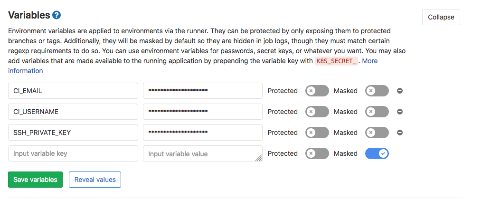
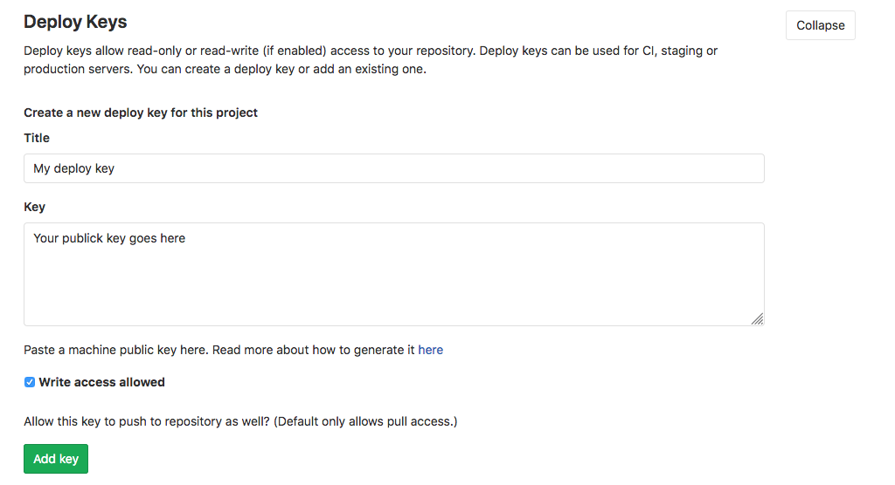
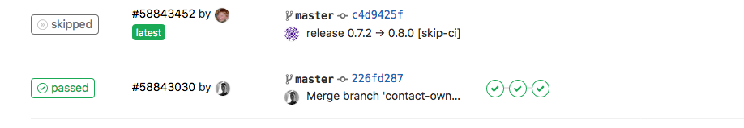

## Create a new release using GitLab CI

For this example, we have a `python/django` application and `Docker` as a containerization tool.

_Goal_: Bump a new version every time that a change occurs on the `master` branch. The bump should be executed automatically by the `CI` process.

### Development Workflow

1. A developer creates a new commit on any branch (except `master`)
2. A developer creates a merge request (MR) against `master` branch
3. When the `MR` is merged into master, the 2 stages of the CI are executed
4. For simplification, we store the software version in a file called `VERSION`. You can use any file that you want as `commitizen` supports it.
5. The commit message executed automatically by the `CI` must include `[skip-ci]` in the message; otherwise, the process will generate a loop. You can define the message structure in [commitizen](../commands/bump.md) as well.

### Authentication options

To let `GitLab CI` runners push the bump commit and tag back to the repository, the runner needs write access. Two common approaches are documented below — pick whichever fits your environment best:

- **[SSH key](#option-a-ssh-key)** — push over `git@`. Requires generating a key pair, storing the private key as a CI variable, and registering the public key as a deploy key.
- **[Project Access Token (HTTPS)](#option-b-project-access-token-https)** — push over `https://`. No SSH client is required; the runner authenticates using a token managed in the GitLab UI.

Both options assume two CI/CD variables holding the git author identity used by the bump commit:

- `CI_EMAIL`
- `CI_USERNAME`

You can create them under your project's `Settings > CI/CD > Variables`.

### Option A: SSH key

To be able to change files and push new changes with `GitLab CI` runners, we need to have a `ssh` key and configure a git user.

First, let's create a `ssh key`. The only requirement is to create it without a passphrase:

```bash
ssh-keygen -f deploy_key -N ""
```

The previous command will create a private and public key under the files `deploy_key` and `deploy_key.pub`. We will use them later.

For the git user, we need an email and username. You can choose whatever you want; in this example, we choose `ci-runner@myproject.com` and `admin`, respectively.

Now, we need to create three environment variables that will be visible for the runners. They should be created in the `variables` section under `settings/ci_cd`:



Create `SSH_PRIVATE_KEY`, `CI_EMAIL`, `CI_USERNAME` variables, and fill them with the `private_key`, `email` and `username` that we have created previously.

The latest step is to create a `deploy key.` To do this, we should create it under the section `settings/repository` and fill it with the `public key` generated before. Check `Write access allowed`; otherwise, the runner won't be able to write the changes to the repository.



If you have more projects under the same organization, you can reuse the deploy key created before, but you will have to repeat the step where we have created the environment variables (ssh key, email, and username).

Tip: If the CI raise some errors, try to unprotect the private key.

#### Defining the GitLab CI Pipeline (SSH)

1. Create a `.gitlab-ci.yaml` file that contains `stages` and `jobs` configurations. You can find more info [here](https://docs.gitlab.com/ee/ci/quick_start/).

2. Define `stages` and `jobs`. For this example, we define two `stages` with one `job` each one.
   - Test the application.
   - Auto bump the version. This means changing the file/s that reflects the version, creating a new commit and git tag.

```yaml
image: docker:latest

services:
  - docker:dind

variables:
  API_IMAGE_NAME: $CI_REGISTRY_IMAGE:$CI_COMMIT_REF_NAME

before_script:
  - apk add --no-cache py-pip
  - pip install docker-compose

stages:
  - test
  - auto-bump

test:
  stage: test
  script:
    - docker-compose run -e DJANGO_ENVIRONMENT=dev your_project python manage.py test # run tests

auto-bump:
  stage: auto-bump
  image: python:3.10
  before_script:
    - "which ssh-agent || ( apt-get update -qy && apt-get install openssh-client -qqy )"
    - eval `ssh-agent -s`
    - echo "${SSH_PRIVATE_KEY}" | tr -d '\r' | ssh-add - > /dev/null # add ssh key
    - pip3 install -U commitizen # install commitizen
    - mkdir -p ~/.ssh
    - chmod 700 ~/.ssh
    - echo "$SSH_PUBLIC_KEY" >> ~/.ssh/id_rsa.pub
    - '[[ -f /.dockerenv ]] && echo -e "Host *\n\tStrictHostKeyChecking no\n\n" > ~/.ssh/config'
  dependencies:
    - test
  script:
    - git remote set-url origin git@gitlab.com:discover/rentee-core.git # git configuration
    - git config --global user.email "${CI_EMAIL}" && git config --global user.name "${CI_USERNAME}"
    - 'exists=`git show-ref refs/heads/master` && if [ -n "$exists" ]; then git branch -D master; fi'
    - git checkout -b master
    - cz bump --yes # execute auto bump and push to master
    - git push origin master:$CI_COMMIT_REF_NAME
    - TAG=$(head -n 1 VERSION) # get the new software version and save into artifacts
    - echo "#!/bin/sh" >> variables
    - echo "export TAG='$TAG'" >> variables
    - git push origin $TAG
  only:
    refs:
      - master
  artifacts:
    paths:
      - variables
```

So, every time that a developer pushes to any branch, the `test` job is executed. If the branch is `master` and the test jobs succeed, the `auto-bump` takes place.
To be able to push using the GitLab runner, we have to set the SSH key, configure git, and finally execute the auto bump.

After merging the new changes into master, we have the final result:



### Option B: Project Access Token (HTTPS)

If you cannot or do not want to manage SSH keys (for example, when your runners do not have an SSH client, or when SSH egress is blocked), you can let the runner push back over `HTTPS` using a [GitLab Project Access Token](https://docs.gitlab.com/user/project/settings/project_access_tokens/). This keeps everything inside the GitLab UI — no key generation, no deploy keys.

!!! note "Group / personal tokens"
    The same approach works with [Group Access Tokens](https://docs.gitlab.com/user/group/settings/group_access_tokens/) (handy when several projects share automation) and [Personal Access Tokens](https://docs.gitlab.com/user/profile/personal_access_tokens/). Project Access Tokens are usually preferred because they are scoped to a single project.

!!! warning "`CI_JOB_TOKEN` is not enough"
    GitLab's built-in `CI_JOB_TOKEN` cannot push to the repository. You need a Project (or Group / Personal) Access Token with at least the `Developer` role and the `write_repository` scope.

#### Step 1: Create a Project Access Token

1. In your GitLab project, go to `Settings > Access Tokens`.
2. Create a new token:
    - **Name**: e.g. `commitizen-bump`.
    - **Role**: `Developer` (or higher) — required to push to protected branches and tags.
    - **Scopes**: tick `write_repository`. `read_repository` is implied.
    - **Expiration date**: pick a date that suits your rotation policy.
3. Click `Create project access token` and **copy the token immediately** — GitLab only shows it once.

#### Step 2: Expose the token to the pipeline

1. Open `Settings > CI/CD > Variables`.
2. Add a new variable:
    - **Key**: `GITLAB_TOKEN` (any name works; this tutorial uses `GITLAB_TOKEN`).
    - **Value**: the token from Step 1.
    - Tick `Masked` so it does not appear in job logs.
    - Tick `Protected` if your bump runs only on protected branches/tags.
3. While you are there, make sure `CI_EMAIL` and `CI_USERNAME` variables exist (they configure the git author for the bump commit).

#### Step 3: Allow the token to push to the protected branch

If `master` (or `main`) is protected, the token's user (a [bot user](https://docs.gitlab.com/user/project/settings/project_access_tokens/#bot-users-for-projects) automatically created with the token) needs permission to push:

- Go to `Settings > Repository > Protected branches`.
- Make sure `Developers + Maintainers` (or at least the role you assigned to the token) is allowed to push.
- Do the same under `Settings > Repository > Protected tags` if you push tags such as `v*`.

#### Step 4: Defining the GitLab CI Pipeline (HTTPS)

The pipeline below mirrors the SSH example but authenticates over HTTPS using the token. It also splits the workflow so that release-only work happens on the bump commit and packaging/publishing only happens once the resulting tag is pushed:

```yaml
image: python:3.10

variables:
  # Use the project URL exposed by GitLab so this works for any fork/mirror.
  REPO_URL: "https://oauth2:${GITLAB_TOKEN}@${CI_SERVER_HOST}/${CI_PROJECT_PATH}.git"

stages:
  - test
  - bump
  - release

test:
  stage: test
  script:
    - pip install -U pip
    - pip install -e .
    - python -m pytest
  rules:
    # Run on every branch and merge request, but skip the bump commit itself.
    - if: $CI_COMMIT_MESSAGE =~ /^bump:/
      when: never
    - when: on_success

bump:
  stage: bump
  before_script:
    - pip install -U commitizen
    - git config --global user.email "${CI_EMAIL}"
    - git config --global user.name "${CI_USERNAME}"
    # Replace the default fetch URL with one that includes the token so we can push.
    - git remote set-url origin "${REPO_URL}"
  script:
    # Re-attach HEAD to the branch (GitLab checks out a detached commit by default).
    - git checkout -B "${CI_COMMIT_REF_NAME}"
    - cz bump --yes
    - git push origin "${CI_COMMIT_REF_NAME}"
    - git push origin --tags
  rules:
    # Only run on the default branch, and never re-bump a bump commit.
    - if: $CI_COMMIT_BRANCH == $CI_DEFAULT_BRANCH && $CI_COMMIT_MESSAGE !~ /^bump:/

release:
  stage: release
  script:
    - pip install -U commitizen build twine
    - cz changelog --dry-run "${CI_COMMIT_TAG}" > release_notes.md
    - python -m build
    # Upload the artifacts to your registry of choice; this is just an example.
    - twine upload --non-interactive dist/*
  rules:
    # This job only runs on tag pipelines created by the `bump` job above.
    - if: $CI_COMMIT_TAG
  artifacts:
    paths:
      - dist/
      - release_notes.md
```

How the pipeline is wired:

- `test` runs on every branch and merge request, but is skipped on the bump commit so we do not waste runners re-testing what was just released.
- `bump` only runs on the default branch and asks `commitizen` to compute the next version, update the version files, write the changelog, commit and tag. The push uses the token via `oauth2:${GITLAB_TOKEN}@…`.
- `release` only runs on tag pipelines (i.e. when the tag pushed by `bump` arrives in GitLab). This is where you would publish artifacts, build and upload a Python package, deploy a Docker image, create a GitLab release, etc.

!!! tip "Avoiding pipeline loops"
    The default `cz bump` commit message starts with `bump:`. The `rules:` blocks above use that prefix to skip both the `test` and `bump` jobs on the bump commit. If you customize `bump_message`, update the regex accordingly. You can also add `[skip ci]` to the bump message — see `bump_message` in the [bump command documentation](../commands/bump.md).

!!! tip "Token rotation"
    Project Access Tokens expire. Set a calendar reminder before the expiration date to rotate the token and update the `GITLAB_TOKEN` CI/CD variable; otherwise the `bump` job will start failing with `403`/`401` errors.
